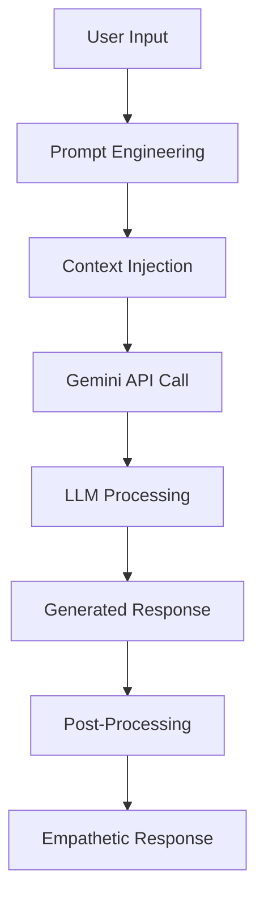
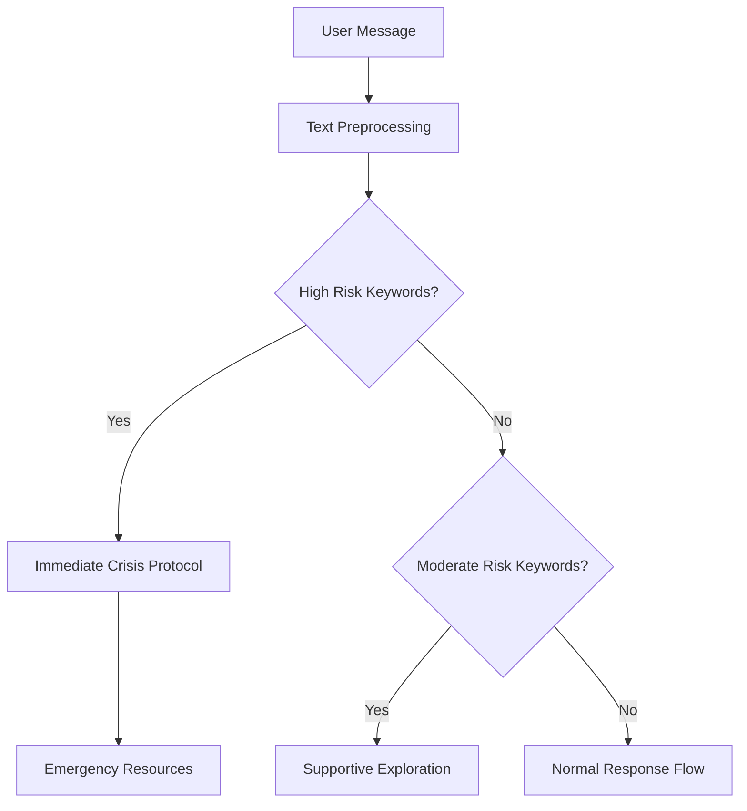
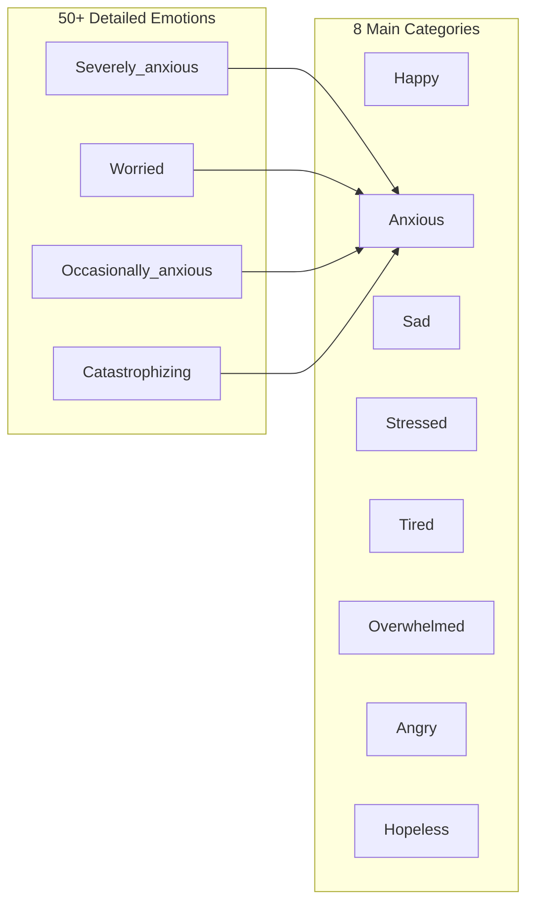
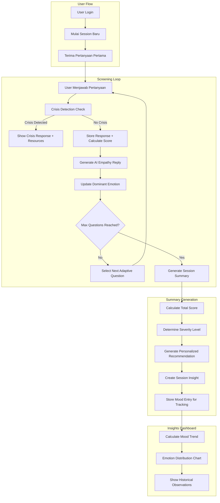
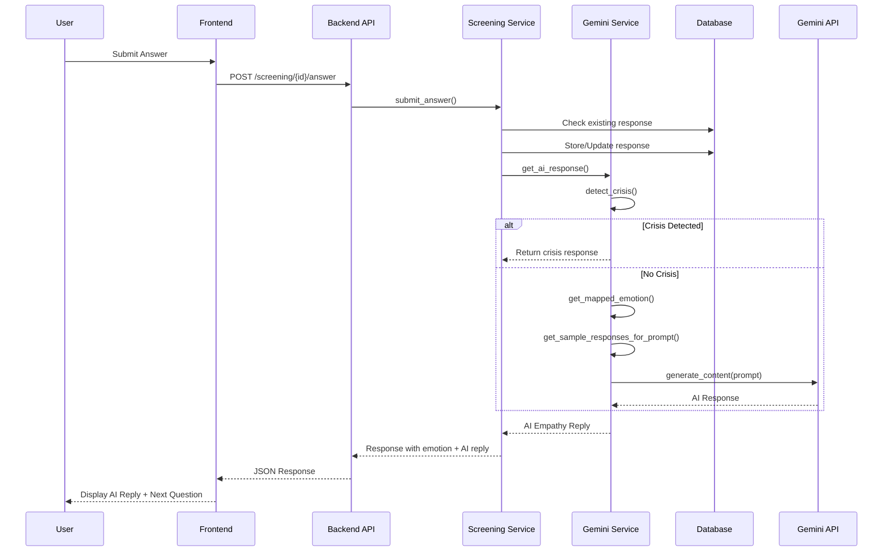
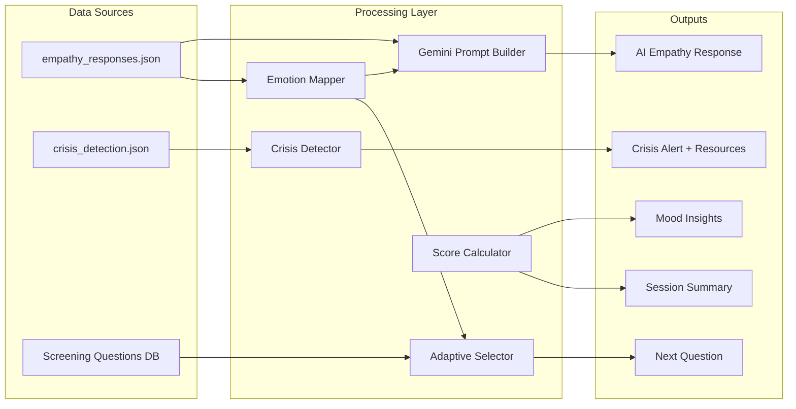
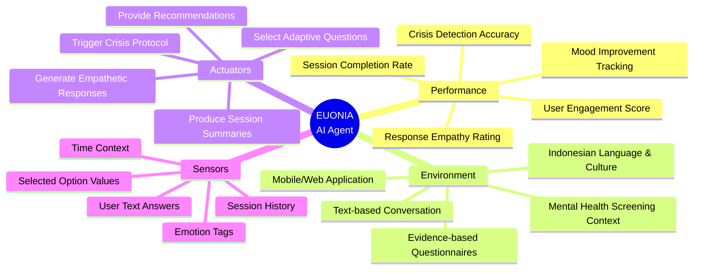

# Analisis Machine Learning Aplikasi Euonia

## 📋 Deskripsi Aplikasi

**Euonia** adalah aplikasi AI companion untuk kesehatan mental yang menggunakan pendekatan berbasis Machine Learning untuk:
- Melakukan screening kesehatan mental secara adaptif
- Mendeteksi krisis dan memberikan respons darurat
- Menghasilkan respons empatik yang personal
- Menganalisis tren mood dan memberikan insight

---

## 1. Cara Kerja Metode/Algoritma Machine Learning

### 1.1 Large Language Model (LLM) - Google Gemini API

**Model yang digunakan:** `gemini-1.5-flash`

**Cara Kerja:**


**Mekanisme Detail:**

1. **Prompt Engineering** - Sistem membangun prompt yang terstruktur dengan:
   - Role definition: "Kamu adalah Eunoia, AI companion empatik yang hangat"
   - Context: Pertanyaan yang ditanyakan dan jawaban user
   - Emotion detection: Tag emosi yang terdeteksi dari jawaban
   - Style reference: Contoh respons empatik dari dataset

2. **Few-Shot Learning** - Memberikan 2 contoh respons dari dataset curated sebagai inspirasi gaya penulisan

3. **Constraint-based Generation** - Batasan seperti:
   - Maksimal 2-3 kalimat
   - Bahasa Indonesia yang hangat dan natural
   - Gunakan emoji 1x jika sesuai

### 1.2 Rule-Based Crisis Detection

**Algoritma:** Pattern Matching dengan Keyword Detection



**Implementasi:**
- **High Risk Detection**: Kata kunci seperti "bunuh diri", "mati saja", "self harm"
- **Moderate Risk Detection**: Kata kunci seperti "putus asa", "tidak ada harapan", "menyerah"
- **Response Mapping**: Setiap level risiko memiliki template respons khusus dengan sumber daya darurat Indonesia

### 1.3 Adaptive Question Selection Algorithm

**Algoritma:** Weighted Randomization with Emotion-Based Prioritization

```python
# Pseudocode
def select_next_question():
    1. Hitung dominant_emotion dari riwayat jawaban
    2. Dapatkan priority_categories berdasarkan dominant_emotion
    3. Untuk setiap category dalam priority:
       a. Ambil pertanyaan yang belum dijawab dalam kategori tersebut
       b. Terapkan weighted randomization (prefer lower order)
       c. Return pertanyaan terpilih
    4. Fallback: Pertanyaan apapun yang belum dijawab
```

**Weighted Randomization Formula:**
```
weights[i] = max(1, 10 - (i * 2))
```
Memberikan bobot lebih tinggi untuk pertanyaan dengan order lebih rendah, tetapi tetap memungkinkan variasi.

### 1.4 Emotion Mapping System

**Algoritma:** Many-to-Few Category Mapping



### 1.5 PHQ-9/GAD-7 Style Scoring System

**Algoritma:** Accumulative Score with Severity Classification

| Score Range | Severity Level | Recommendation |
|-------------|---------------|----------------|
| 0-7 | Minimal | Pertahankan rutinitas positif |
| 8-14 | Mild | Rekomendasi spesifik per emosi |
| 15-21 | Moderate | Disarankan konsultasi profesional |
| 22+ | Moderately Severe | Segera konsultasi psikolog/psikiater |

---

## 2. Dasar Pemilihan Algoritma

### 2.1 Mengapa Large Language Model (Gemini)?

| Aspek | Alasan |
|-------|--------|
| **Natural Language Understanding** | LLM dapat memahami nuansa bahasa Indonesia termasuk slang dan konteks budaya |
| **Empathetic Response Generation** | Kemampuan menghasilkan respons yang terasa personal dan tidak robotic |
| **Flexibility** | Dapat beradaptasi dengan berbagai topik kesehatan mental tanpa hardcoding setiap skenario |
| **Prompt Engineering** | Lebih mudah dikontrol melalui prompt daripada melatih model dari awal |
| **Cost Effective** | Gemini Flash lebih cepat dan murah dibanding model lainnya |

### 2.2 Mengapa Rule-Based untuk Crisis Detection?

| Aspek | Alasan |
|-------|--------|
| **Reliability** | Dalam situasi krisis, konsistensi lebih penting daripada kreativitas |
| **Zero Tolerance for Errors** | ML model bisa miss-classify, tapi keyword detection 100% reliable |
| **Compliance** | Memenuhi standar keamanan dengan respons yang sudah diverifikasi |
| **Speed** | Tidak perlu API call, langsung detect dan respond |
| **Auditability** | Mudah untuk di-audit dan di-improve keyword database |

### 2.3 Mengapa Adaptive Question Selection?

| Aspek | Alasan |
|-------|--------|
| **Personalization** | Pertanyaan menyesuaikan dengan kondisi emosi user saat itu |
| **Efficiency** | Lebih cepat mengidentifikasi masalah utama user |
| **Engagement** | User merasa didengar karena pertanyaan relevan dengan jawabannya |
| **Variasi** | Weighted randomization mencegah pola pertanyaan yang monoton |

### 2.4 Mengapa PHQ-9/GAD-7 Style Scoring?

| Aspek | Alasan |
|-------|--------|
| **Evidence-Based** | PHQ-9 dan GAD-7 adalah instrumen screening yang sudah tervalidasi secara klinis |
| **Standardized** | Memungkinkan perbandingan skor antar sesi dan antar user |
| **Interpretable** | Severity level mudah dipahami oleh user dan profesional |
| **Actionable** | Setiap level memiliki rekomendasi konkret yang bisa diikuti |

---

## 3. Alur Kerja Sistem

### 3.1 Flowchart Keseluruhan Sistem



### 3.2 Sequence Diagram - Single Question Flow



### 3.3 Data Flow Diagram



---

## 4. Analisis P.E.A.S

### 4.1 Definisi PEAS

PEAS adalah framework untuk mendefinisikan task environment dari intelligent agent:
- **P**erformance Measure: Bagaimana mengukur keberhasilan agent
- **E**nvironment: Lingkungan di mana agent beroperasi
- **A**ctuators: Tindakan yang dapat dilakukan agent
- **S**ensors: Input yang diterima agent

### 4.2 PEAS Analysis untuk Euonia



### 4.3 Detail PEAS Table

| Komponen | Detail | Metrik/Contoh |
|----------|--------|---------------|
| **Performance Measure** |||
| User Engagement | Apakah user menyelesaikan sesi? | Session completion rate > 80% |
| Crisis Detection | Akurasi mendeteksi situasi darurat | False negative = 0 (zero tolerance) |
| Empathy Quality | Respons terasa personal dan suportif | User tidak skip AI reply |
| Insight Usefulness | Rekomendasi actionable dan relevan | Skor mood improvement positif |
| **Environment** |||
| Task Type | Mental health screening & support | 25 pertanyaan adaptif per sesi |
| Language | Bahasa Indonesia dengan nuansa budaya | Termasuk bahasa gaul dan empati lokal |
| Platform | Text-based conversation interface | Mobile-first responsive design |
| Data | Evidence-based questionnaires | PHQ-9/GAD-7 style dengan modifikasi |
| **Actuators** |||
| Text Generation | Menghasilkan respons empatik | Via Gemini API prompt engineering |
| Question Selection | Memilih pertanyaan adaptif | Weighted randomization algorithm |
| Crisis Response | Menampilkan sumber daya darurat | Hotline Indonesia 119 ext 8 |
| Summary Generation | Membuat ringkasan sesi | AI-generated dengan interpretasi skor |
| Recommendations | Memberikan saran konkret | Per-emotion specific recommendations |
| **Sensors** |||
| User Input | Jawaban teks/pilihan dari user | Selected option dengan value 0-3 |
| Emotion Tags | Tag emosi dari setiap jawaban | 50+ emotion variants |
| History | Riwayat sesi sebelumnya | MoodEntry records untuk trend |
| Time Context | Waktu dan durasi sesi | Used for session analytics |

### 4.4 Environment Characteristics

| Karakteristik | Nilai | Penjelasan |
|---------------|-------|------------|
| **Fully Observable vs Partially** | Partially Observable | Agent tidak melihat kondisi mental sesungguhnya, hanya jawaban text |
| **Deterministic vs Stochastic** | Stochastic | Respons user tidak dapat diprediksi dengan pasti |
| **Episodic vs Sequential** | Sequential | Jawaban sebelumnya mempengaruhi pertanyaan selanjutnya |
| **Static vs Dynamic** | Static | Environment tidak berubah saat agent "berpikir" |
| **Discrete vs Continuous** | Discrete | Pilihan jawaban terbatas, pertanyaan finite |
| **Single vs Multi-agent** | Single Agent | Hanya 1 AI agent per user conversation |

---

## 5. Arsitektur Teknis

### 5.1 Tech Stack

| Layer | Technology |
|-------|------------|
| Frontend | React + TypeScript |
| Backend | Flask (Python) |
| Database | SQLite |
| AI/ML | Google Gemini API (gemini-1.5-flash) |
| Data | JSON datasets (empathy, crisis) |

### 5.2 File Structure - ML Components

```
backend/
├── app/
│   ├── services/
│   │   ├── gemini_service.py      # LLM integration & prompt engineering
│   │   ├── screening_service.py   # Adaptive question selection
│   │   ├── insights_service.py    # Mood trend calculation
│   │   └── session_service.py     # Session management
│   ├── models/
│   │   └── screening.py           # Question, Option, Response models
│   └── seeds/
│       └── questions.json         # Screening questions database
├── data/
│   ├── empathy_responses.json     # Curated empathy response dataset
│   └── crisis_detection.json      # Crisis keywords & resources
```

---

## 6. Kesimpulan

Aplikasi Euonia menggunakan **pendekatan hybrid** yang menggabungkan:

1. **Generative AI (LLM)** untuk respons empatik yang natural dan personal
2. **Rule-based Systems** untuk critical path seperti crisis detection
3. **Algorithmic Solutions** untuk adaptive question selection dan scoring
4. **Evidence-based Framework** mengadopsi PHQ-9/GAD-7 untuk credibility

Pendekatan ini memastikan:
- ✅ **Keamanan** - Crisis detection yang reliable
- ✅ **Personalisasi** - Respons dan pertanyaan adaptif
- ✅ **Kredibilitas** - Berbasis instrumen screening tervalidasi
- ✅ **Engagement** - AI yang terasa seperti companion, bukan robot
